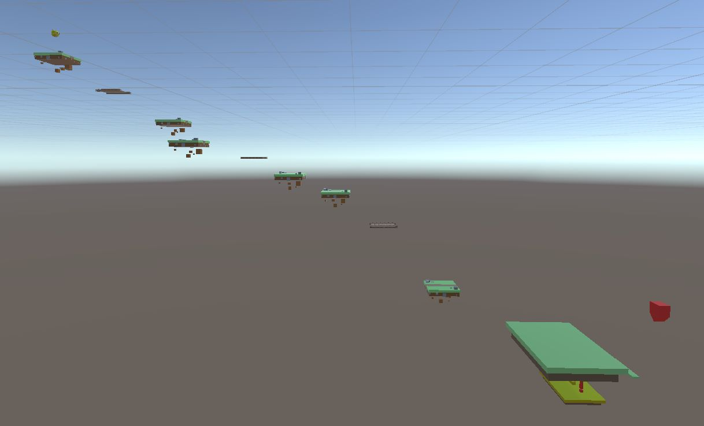
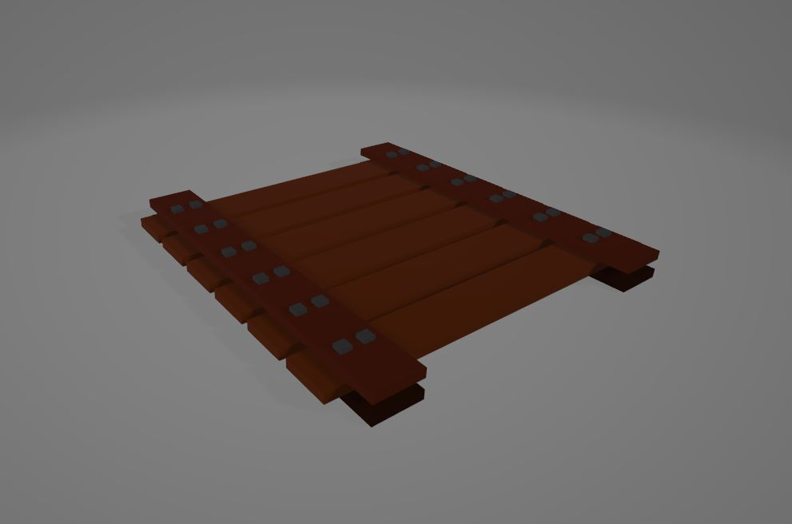
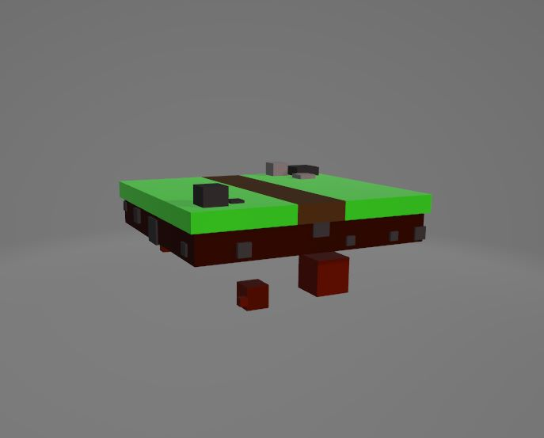
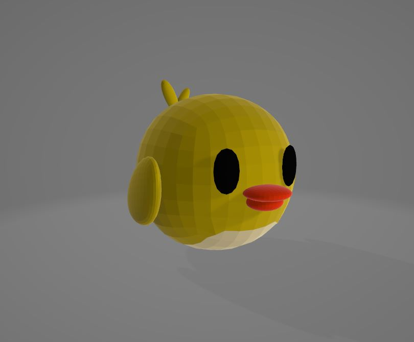
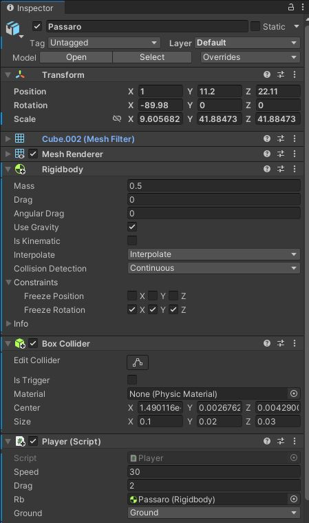
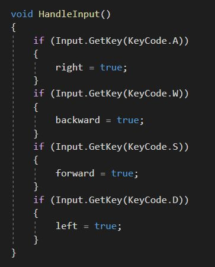
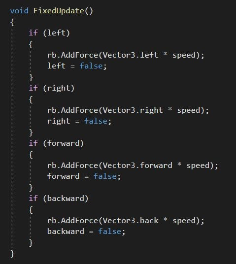

# Desenvolvimento de Cena
 
## Introdução 📔
Nesse trabalho estaremos fazendo um jogo programado e feito no Unity, para a aula de Lógica de Programação, o próposito do jogo é do player passar por plataformas para alcançar a chegada final.

## Cénario ✏️
No cénario, algumas das plataformas foram feitas através do software Blender para terem mais detalhes, já a linha de chegada "as plataformas finais" foram feitas no próprio Unity usando os Game Objects disponiveis, em cada uma das plataformas foi adicionada um Box colider para que o personagem não atravessasse, tendo feito isso, começamos a montar o game Design para o cenário, modificando as posições <strong> x, y, z</strong> de cada objeto da cena.

 
 
 

## Personagem  🐤
Nosso personagem foi modelado inteiramente no Blender, quando exportamos o modelo para a unity no formato <strong>FBX</strong>, criamos uma Box Collider ao personagem e um Rigidybody para as colisões e interações com o cenário, em seguida partimos para a sua movimentação no código.

 

  
  
 

# Códigos⚙️
Para que o nosso personagem pudesse andar, fiz uma condição que toda vez quo o usuário clicasse nas teclas <strong>"W, A, S, D"</strong>, transformaria suas váriaveis de movimento em verdadeiras, assim se interligando com uma outra condição criada para que quando os valores fossem verdadeiros, adicionasse a variavel speed ao Vector3 da direção clicada, fazendo com que fosse possível o personagem se mover nas 4 direções.

 
 

